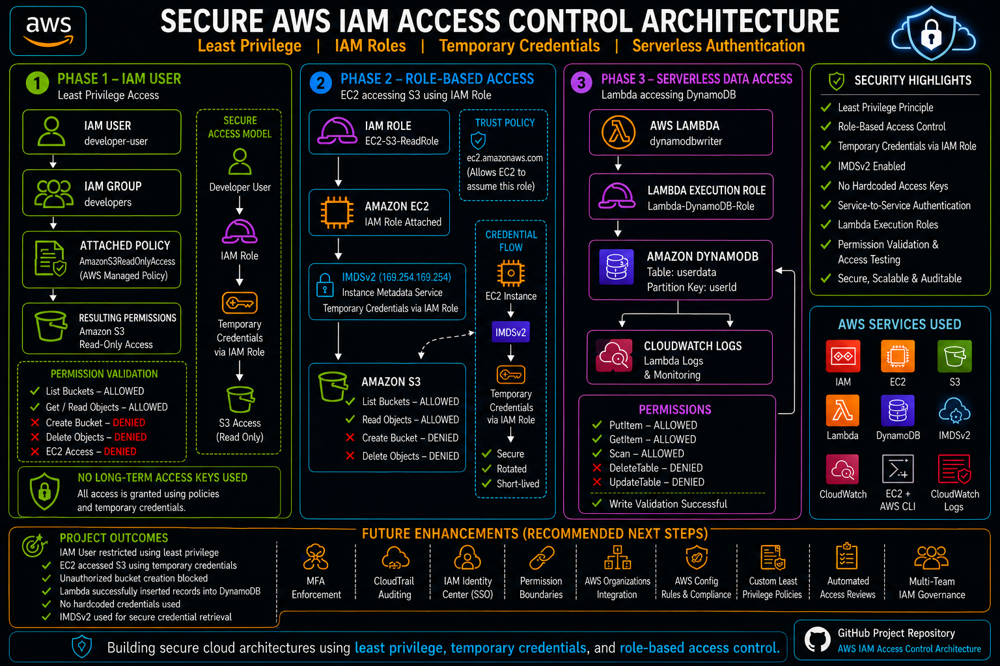

<div align="center">

# 🔐 Secure AWS IAM Access Control Architecture

### Designing Secure Cloud Access Using Least Privilege, IAM Roles, Temporary Credentials, and Serverless Authentication


</div>

---

# 🌍 Real-World Problem Statement

Cloud security incidents are often caused by excessive permissions, long-lived access keys, and poor identity management practices.

In many AWS environments:

- Developers receive permissions beyond what they actually require.
- Applications store AWS access keys directly in code or configuration files.
- EC2 instances use static credentials to access AWS services.
- Serverless workloads are granted broader permissions than necessary.
- Access boundaries are not enforced consistently across services.

These practices increase the risk of:

- Unauthorized resource access
- Credential leakage
- Privilege escalation
- Accidental data exposure
- Cloud account compromise

As organizations scale, securing identities and permissions becomes one of the most important challenges in cloud architecture.

---

# 🎯 Project Objective

The goal of this project was to design and implement a secure AWS access control architecture that follows AWS security best practices.

The solution focuses on:

✅ Enforcing Least Privilege Access

✅ Eliminating Hardcoded Credentials

✅ Implementing Role-Based Access Control (RBAC)

✅ Using Temporary Credentials Instead of Access Keys

✅ Securing EC2 Access to AWS Services

✅ Implementing Serverless Authentication

✅ Applying Fine-Grained DynamoDB Permissions

✅ Validating Security Controls Through Testing

---

# 🏗️ Solution Overview

To solve these challenges, a three-phase AWS IAM architecture was implemented.

### Phase 1 — Least Privilege IAM Access

A dedicated IAM user was created and assigned only the permissions required to perform read-only operations on Amazon S3.

Validation confirmed that:

- S3 Read Operations were allowed
- S3 Write Operations were denied
- EC2 Access was denied

This demonstrates enforcement of the Principle of Least Privilege.

---

### Phase 2 — Role-Based Access Control

An IAM Role was attached to an EC2 instance through an Instance Profile.

Instead of using long-term AWS access keys:

```text
EC2 Instance
      │
      ▼
IAM Role
      │
      ▼
IMDSv2
      │
      ▼
Temporary Credentials
      │
      ▼
Amazon S3
```

This approach:

- Eliminates credential storage
- Enables automatic credential rotation
- Reduces attack surface
- Improves operational security

---

### Phase 3 — Serverless Authentication

AWS Lambda was configured with a dedicated execution role.

The function accessed DynamoDB using IAM-based authentication without storing any credentials.

Validation confirmed:

- PutItem → Allowed
- GetItem → Allowed
- Scan → Allowed
- DeleteTable → Denied
- UpdateTable → Denied

This demonstrates secure service-to-service authentication in serverless environments.

---

# 🏗️ Architecture Diagram

<p align="center">
  
</p>

---

# 🔄 Architecture Workflow

### Phase 1 — IAM User & Least Privilege

```text
IAM User
      │
      ▼
IAM Group
      │
      ▼
AmazonS3ReadOnlyAccess
      │
      ▼
Amazon S3
```

Result:

✅ Read Access Allowed

❌ Write Access Denied

❌ EC2 Access Denied

---

### Phase 2 — Secure EC2 Authentication

```text
EC2 Instance
      │
      ▼
IAM Role
      │
      ▼
IMDSv2
      │
      ▼
Temporary Credentials
      │
      ▼
Amazon S3
```

Result:

✅ Read Access Allowed

❌ Bucket Creation Denied

❌ Static Credentials Required

---

### Phase 3 — Serverless Authentication

```text
AWS Lambda
      │
      ▼
Execution Role
      │
      ▼
Amazon DynamoDB
      │
      ▼
CloudWatch Logs
```

Result:

✅ Secure DynamoDB Access

✅ Automatic Authentication

✅ No Credentials Stored in Code

---

# ☁️ AWS Services Used

| Service | Purpose |
|----------|----------|
| AWS IAM | Identity and Access Management |
| Amazon EC2 | Compute Instance |
| Amazon S3 | Object Storage |
| AWS Lambda | Serverless Compute |
| Amazon DynamoDB | NoSQL Database |
| Amazon CloudWatch | Monitoring and Logging |
| IMDSv2 | Secure Metadata Access |
| AWS CLI | Access Validation |

---

# 📂 Repository Structure

```text
secure-aws-iam-access-control-architecture
│
├── architecture
├── documentation
├── implementation-walkthrough
├── lambda-code
├── policies
├── cli-commands
└── README.md
```

---

# 📚 Project Resources

### 🏗️ Architecture

➡️ [Architecture Documentation](./architecture/README.md)

---

### 📸 Implementation Walkthrough

➡️ [Implementation Walkthrough](./implementation-walkthrough/README.md)

---

### ⚡ Lambda Code

➡️ [Lambda Code](./lambda-code/README.md)

---

### 🔐 IAM Policies

➡️ [Policies](./policies/README.md)

---

### 💻 CLI Commands

➡️ [CLI Commands](./cli-commands/README.md)

---

### 📄 Full Documentation

➡️ [Documentation README](./documentation/README.md)

➡️ [Open Project PDF](./documentation/Secure_AWS_IAM_Architecture.pdf)

---

# 🧪 Security Validation Results

| Validation | Result |
|------------|---------|
| Least Privilege Enforced | ✅ |
| IAM Group Permissions Tested | ✅ |
| IAM Role Authentication Verified | ✅ |
| Temporary Credentials Retrieved | ✅ |
| IMDSv2 Validation Successful | ✅ |
| Lambda Authentication Verified | ✅ |
| DynamoDB Access Tested | ✅ |
| Unauthorized Actions Blocked | ✅ |
| No Hardcoded Credentials Used | ✅ |

---

# 📈 Project Outcomes

✅ IAM User restricted using least privilege

✅ EC2 accessed S3 using temporary credentials

✅ Unauthorized bucket creation blocked

✅ Lambda successfully inserted records into DynamoDB

✅ No hardcoded credentials used

✅ IMDSv2 used for secure credential retrieval

✅ Service-to-service authentication implemented

✅ AWS security best practices applied throughout the architecture

---

# 🔮 Future Enhancements

- MFA Enforcement
- CloudTrail Auditing
- IAM Identity Center (SSO)
- Permission Boundaries
- AWS Organizations
- AWS Config Rules & Compliance
- Automated IAM Access Reviews
- Multi-Team IAM Governance

---

# 🧠 Key Learnings

- Least Privilege is the foundation of AWS security.
- IAM Roles are preferred over access keys.
- Temporary credentials reduce security risk.
- IMDSv2 protects EC2 metadata endpoints.
- Lambda Execution Roles eliminate credential management.
- Fine-grained permissions reduce attack surface.
- Secure authentication should be identity-driven, not key-driven.

---

# 👨‍💻 Author

### Adhithyan Sivaraman T

AWS Student Builder Group Leader  
Cloud & DevOps Enthusiast  
Federal Institute of Science and Technology (FISAT)

---

<div align="center">

### ⭐ Building Secure Cloud Architectures Through Identity-Driven Access Control

AWS IAM • Security • Cloud Architecture • DevSecOps

</div>
