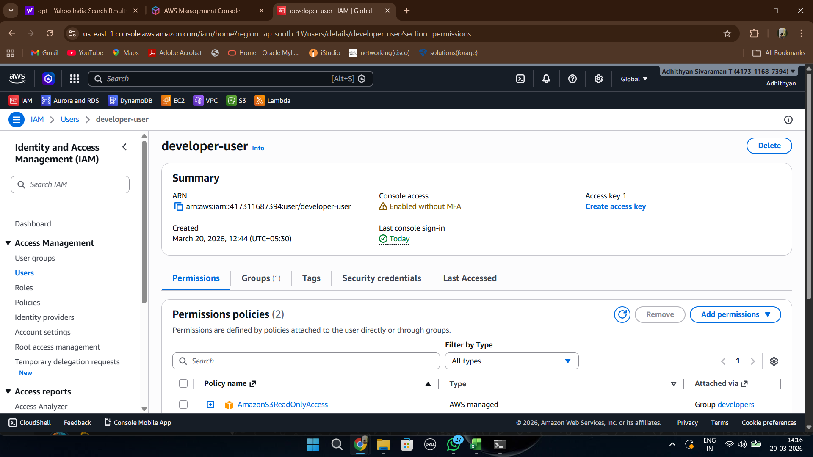
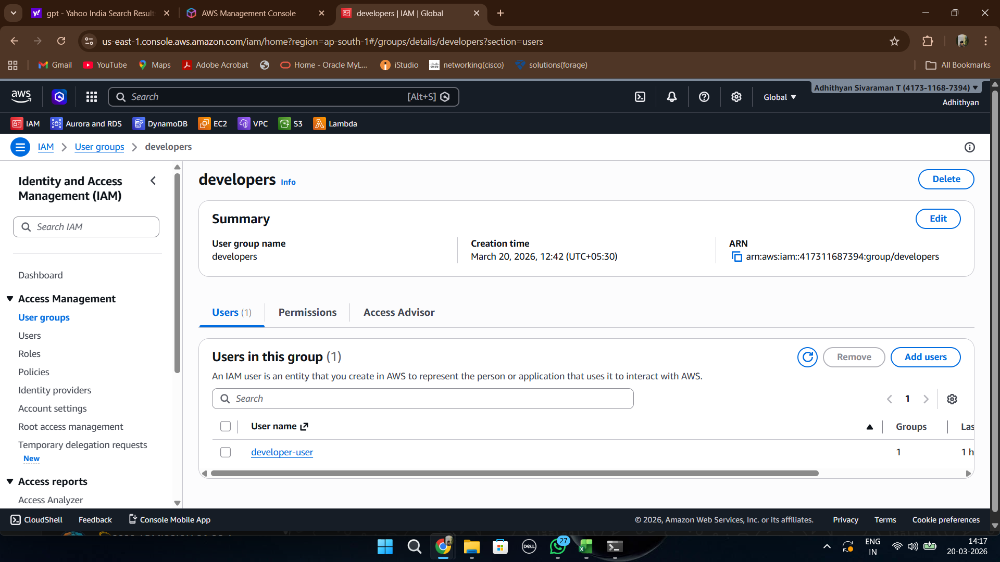
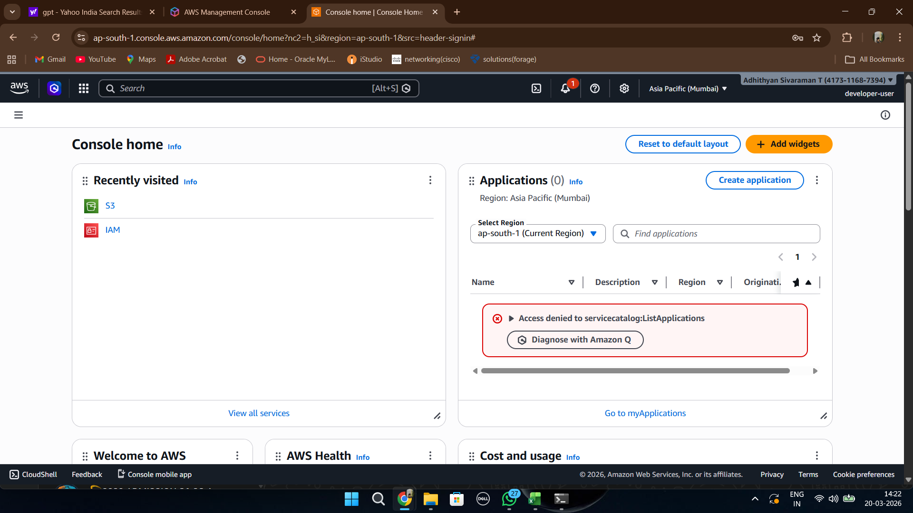
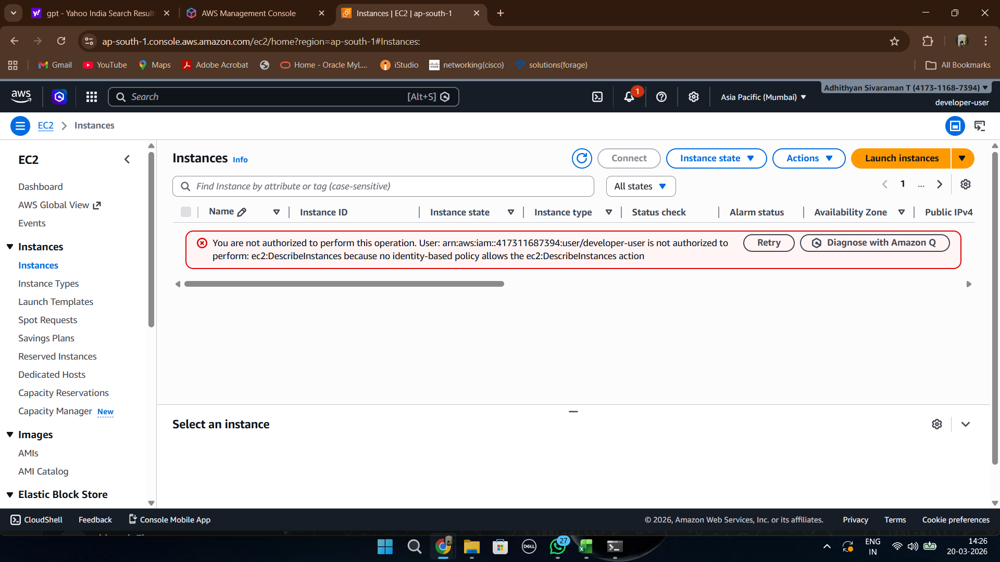

# Phase 1 - IAM Security

This phase demonstrates implementation of least-privilege access using IAM users and groups.

## IAM User Creation

Created a restricted IAM user named developer-user.

## IAM Group Creation

Created a developers group and attached AmazonS3ReadOnlyAccess policy.

## Login as Restricted User

Logged in using the restricted IAM user.

## S3 Read Access Verification

Successfully viewed S3 buckets.

## S3 Write Access Denied

Bucket creation failed because write permissions were not granted.

## EC2 Access Denied

EC2 access was blocked due to missing permissions.
