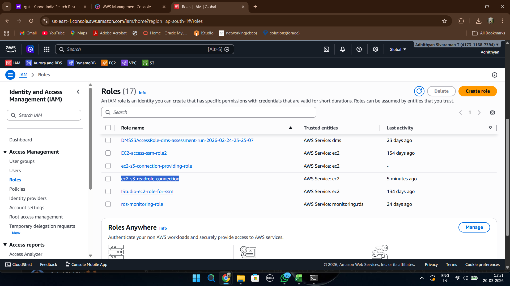
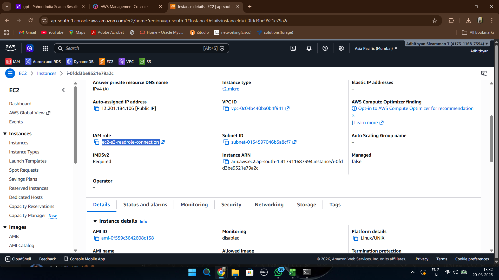
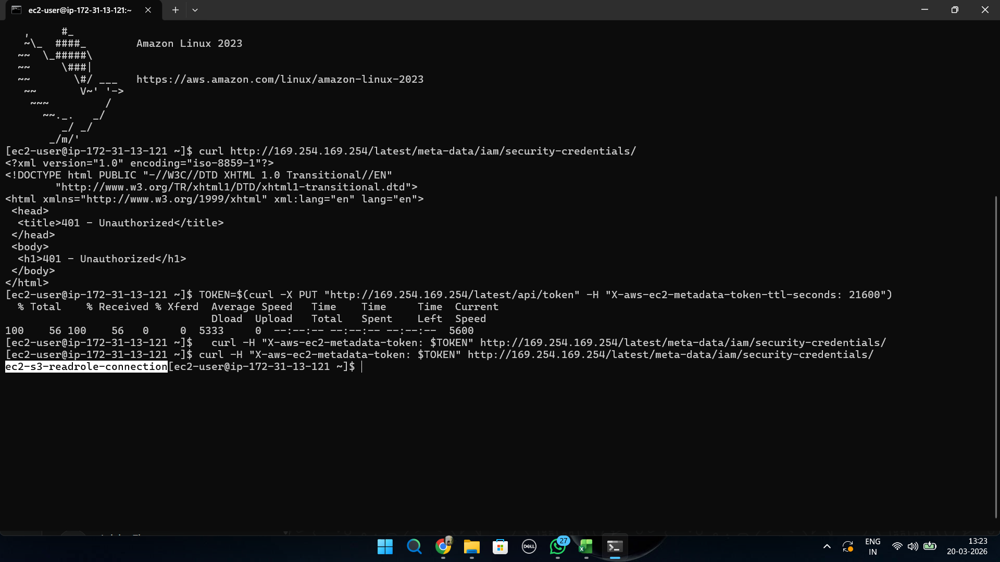
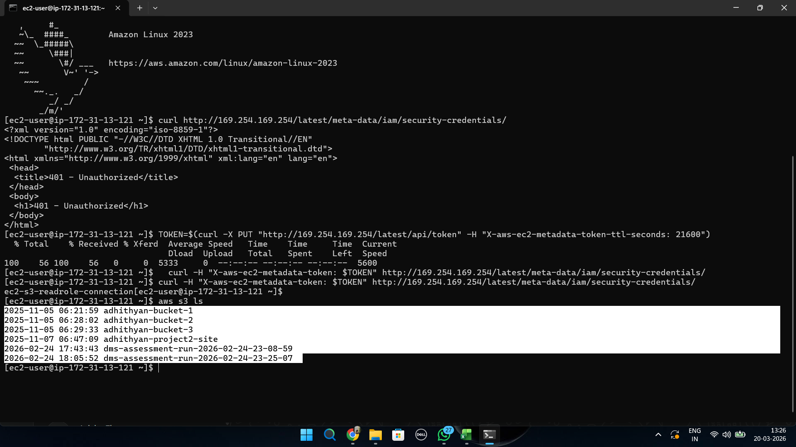
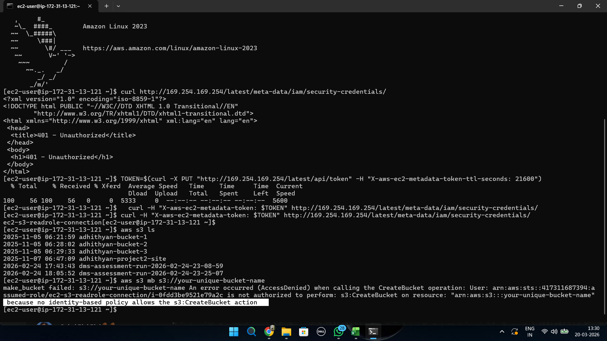

# Phase 2 - Role Based Access

## Objective

This phase demonstrates how IAM Roles provide secure temporary credentials to EC2 instances without storing AWS access keys.

---

## Step 1: Create IAM Role for EC2

An IAM role named **ec2-s3-readrole-connection** was created and configured with Amazon S3 ReadOnly permissions.

This role allows EC2 instances to access S3 resources securely using temporary credentials.

---

## Step 2: Launch EC2 Instance with IAM Role

An EC2 instance was launched with the IAM role attached during instance creation.

This eliminates the need to manually configure AWS access keys inside the server.

---

## Step 3: Verify Role Using IMDSv2

The EC2 Instance Metadata Service Version 2 (IMDSv2) was used to verify that the instance successfully received temporary credentials from the attached IAM role.

The role name was retrieved from the metadata endpoint.

---

## Step 4: Access S3 from EC2

Using AWS CLI commands from the EC2 instance, S3 buckets were listed successfully.

This confirms that the IAM role permissions were working correctly.

---

## Step 5: Verify Least Privilege Enforcement

An attempt was made to create a new S3 bucket from the EC2 instance.

The operation failed with an Access Denied error because the role only had read permissions.

This validates the Principle of Least Privilege by ensuring that only approved actions are allowed.

---

## Key Learnings

* IAM Roles are more secure than long-term access keys.
* EC2 instances can obtain temporary credentials automatically.
* IMDSv2 provides secure metadata access.
* Role-based authentication enables secure service access.
* Least Privilege prevents unauthorized resource modifications.

