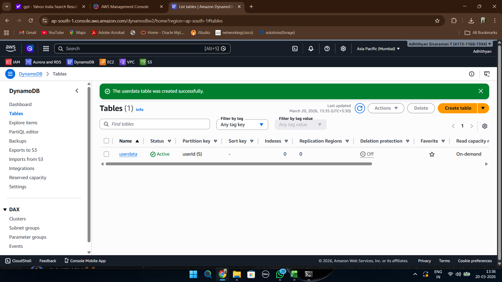
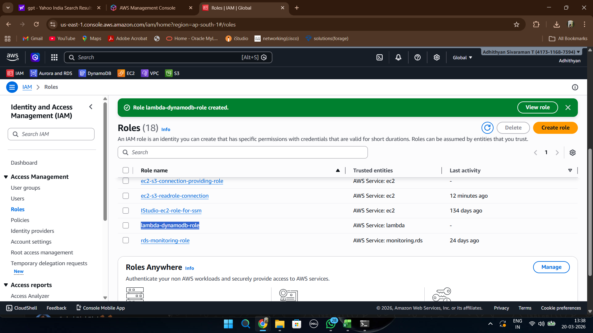
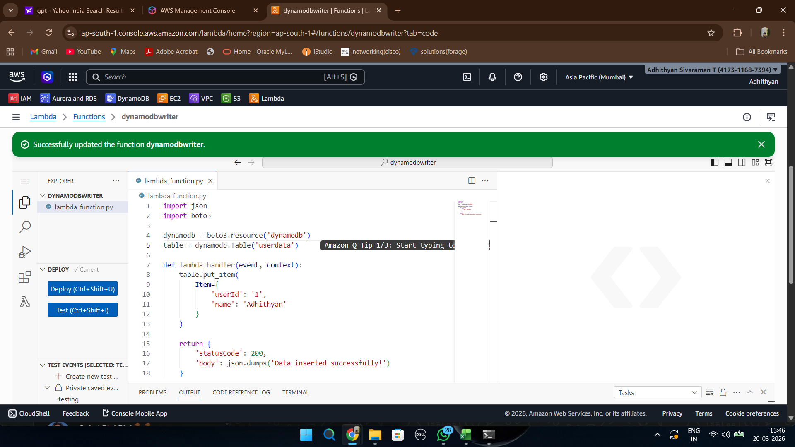
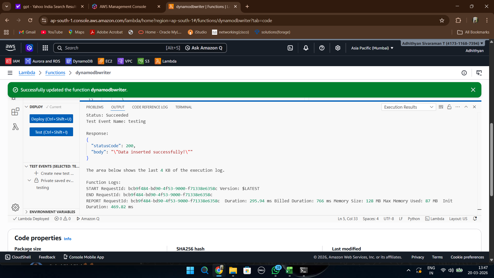
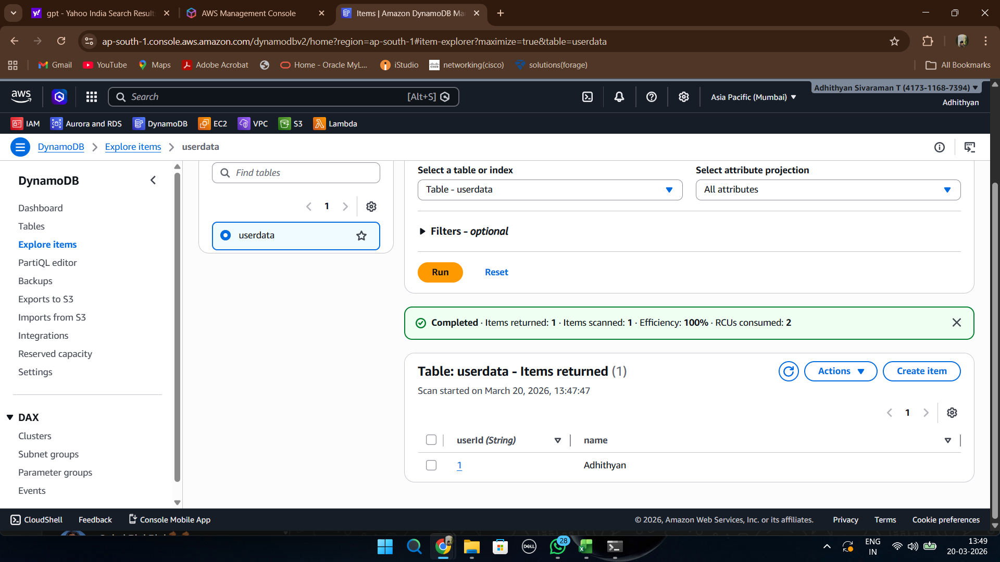

# Phase 3 - Serverless Access

## Objective

This phase demonstrates secure service-to-service communication using AWS Lambda, DynamoDB, and IAM Roles.

---

## Step 1: Create DynamoDB Table

A DynamoDB table named **userdata** was created.

The table uses **userId** as the partition key and serves as the backend datastore for the Lambda function.

---

## Step 2: Create IAM Role for Lambda

An IAM execution role was created for Lambda.

The role was granted permissions to:

* Access DynamoDB
* Write logs to CloudWatch

This follows AWS security best practices by granting only the required permissions.

---

## Step 3: Deploy Lambda Function

A Python Lambda function was developed using the boto3 SDK.

The function inserts data into the DynamoDB table whenever it is invoked.

The Lambda execution role provides temporary credentials automatically.

---

## Step 4: Execute Test Event

A test event was executed from the Lambda console.

The function completed successfully and returned a success response.

This confirmed that:

* Lambda code was functioning correctly
* IAM permissions were configured properly
* DynamoDB connectivity was working

---

## Step 5: Verify Data Insertion

The DynamoDB table was inspected after Lambda execution.

The inserted record was successfully stored in the table.

This verifies secure service-to-service authentication using IAM Roles without storing access keys.

---

## Key Learnings

* AWS Lambda uses execution roles for authentication.
* Temporary credentials are automatically managed by AWS.
* DynamoDB can be accessed securely without embedding secrets.
* IAM Roles enable secure service-to-service communication.
* Serverless architectures reduce operational overhead while maintaining strong security.
